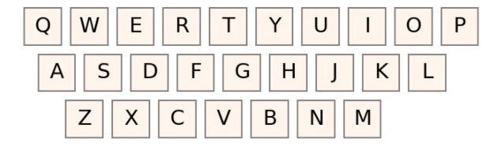

# What is qwerty-keyboard?

It is a challenge where:
>Given a QWERTY keyboard grid and a remote control with arrows and a “select” button, write a function that returns the buttons you have to press to type a certain word. The cursor will always start in the upper left at the letter Q


One example of these will be the following
```
$ remoteControl('car')
$ 'down, down, right, right, select, left, left, up, select, up, right, right, right, select'
```

# Image of reference

